# 🛒 사용자 구매 경험 완성 - 마일스톤 계획

## 📋 프로젝트 개요

**목표**: 상품 발견부터 결제 완료까지 완전한 구매 경험 구현  
**범위**: 상품 상세 → 장바구니 → 체크아웃 → 결제 → 주문 관리 전체 플로우  
**예상 기간**: 2-3주 (6개 마일스톤)

### 🎯 핵심 구매 플로우
1. **상품 상세 페이지**: 실제 API 데이터로 상품 정보 표시, 장바구니 담기
2. **장바구니 페이지**: 아이템 관리, 수량 변경, 총액 계산
3. **체크아웃 페이지**: 배송지 입력, 결제 수단 선택, 주문 생성
4. **결제 페이지**: 다양한 결제 수단 처리, 결제 완료/실패 처리
5. **주문 관리**: 주문 완료, 내역 조회, 추적 기능

---

## 🚀 마일스톤별 상세 계획

### Milestone 1: 상품 상세 페이지 API 연동
**기간**: 1-2일  
**목표**: 실제 API 데이터로 상품 상세 페이지 완성

#### 프론트엔드 작업
- [ ] Detail.tsx API 연동 구현
  - [ ] `productService.getProduct(productId)` 호출
  - [ ] 실제 상품 데이터 로딩 및 표시
  - [ ] 로딩 스피너 및 에러 처리 구현
- [ ] 장바구니 담기 기능 구현
  - [ ] `cartService.addToCart()` API 호출
  - [ ] 옵션 선택 검증 로직
  - [ ] 성공/실패 토스트 메시지
- [ ] 상품 옵션 관리
  - [ ] 네일 모양/길이 옵션 검증
  - [ ] 재고 확인 및 품절 처리
  - [ ] 옵션별 가격 변동 처리

#### 백엔드 작업  
- [ ] 상품 상세 API 최적화
  - [ ] 응답 속도 개선 (이미지, 리뷰 데이터 포함)
  - [ ] 관련 상품 추천 로직 확인
- [ ] 장바구니 담기 API 검증
  - [ ] 재고 확인 로직
  - [ ] 동시성 처리 (여러 사용자 동일 상품 구매)
- [ ] 상품 옵션 데이터 구조 확인
  - [ ] 네일 카테고리/옵션 정합성 검증

---

### Milestone 2: 장바구니 페이지 구현  
**기간**: 2-3일  
**목표**: 완전한 장바구니 관리 기능 구현

#### 프론트엔드 작업
- [ ] `CartPage.tsx` 컴포넌트 생성
  - [ ] 장바구니 아이템 목록 표시
  - [ ] `cartService.getCart()` API 연동
  - [ ] 빈 장바구니 상태 처리
- [ ] 장바구니 아이템 관리
  - [ ] 수량 변경 (`cartService.updateCartItem()`)
  - [ ] 개별 아이템 삭제 (`cartService.removeFromCart()`)
  - [ ] 전체 장바구니 비우기 (`cartService.clearCart()`)
- [ ] 총 금액 계산 및 표시
  - [ ] 상품 금액, 배송비, 할인 적용
  - [ ] 실시간 총액 업데이트
- [ ] 체크아웃 진행
  - [ ] 체크아웃 버튼 구현
  - [ ] 로그인 필요 시 로그인 페이지 이동

#### 백엔드 작업
- [ ] 장바구니 CRUD API 성능 최적화
  - [ ] 다중 아이템 업데이트 배치 처리
  - [ ] 장바구니 동기화 로직 개선
- [ ] 총액 계산 로직 검증
  - [ ] 할인 쿠폰 적용 로직
  - [ ] 배송비 계산 규칙 구현
- [ ] 재고 부족 처리
  - [ ] 장바구니 내 품절 상품 알림
  - [ ] 수량 조정 제안 로직

---

### Milestone 3: 체크아웃 페이지 구현
**기간**: 3-4일  
**목표**: 주문 생성까지의 체크아웃 프로세스 완성

#### 프론트엔드 작업
- [ ] `CheckoutPage.tsx` 컴포넌트 생성
  - [ ] 다단계 체크아웃 프로세스 UI
  - [ ] 진행 단계 표시 (배송 → 결제 → 확인)
- [ ] 배송지 관리
  - [ ] 배송지 입력/수정 폼
  - [ ] 기본 배송지 선택
  - [ ] 새 배송지 저장 기능
- [ ] 결제 수단 선택
  - [ ] 신용카드, 계좌이체, 간편결제 옵션
  - [ ] `paymentService.getPaymentMethods()` 연동
- [ ] 주문 요약 및 생성
  - [ ] 주문 상품 목록 표시
  - [ ] 최종 결제 금액 확인
  - [ ] `orderService.createOrder()` API 호출
- [ ] 폼 검증 및 에러 처리
  - [ ] 필수 필드 검증
  - [ ] 실시간 폼 validation

#### 백엔드 작업
- [ ] 주문 생성 API 트랜잭션 처리
  - [ ] 장바구니 → 주문 변환 로직
  - [ ] 재고 차감 원자성 보장
  - [ ] 주문 실패 시 롤백 처리
- [ ] 배송비 계산 엔진
  - [ ] 지역별 배송비 계산
  - [ ] 무료배송 조건 확인
- [ ] 쿠폰/포인트 시스템
  - [ ] 할인 쿠폰 적용 로직
  - [ ] 포인트 사용/적립 처리
- [ ] 주문 번호 생성 및 관리
  - [ ] 유니크 주문번호 생성 알고리즘

---

### Milestone 4: 결제 시스템 구현
**기간**: 4-5일  
**목표**: 다양한 결제 수단을 통한 결제 처리 완성

#### 프론트엔드 작업  
- [ ] `PaymentPage.tsx` 컴포넌트 생성
  - [ ] 결제 수단별 UI 구현
  - [ ] 결제 진행 상태 표시 (로딩, 처리 중, 완료)
- [ ] 결제 수단 처리
  - [ ] 신용카드 결제 폼 (카드번호, CVC, 유효기간)
  - [ ] 계좌이체 은행 선택
  - [ ] 간편결제 (카카오페이, 네이버페이 등) 연동
- [ ] 결제 API 연동
  - [ ] `paymentService.initializePayment()` 호출
  - [ ] `paymentService.confirmPayment()` 처리
  - [ ] 결제 상태 실시간 확인
- [ ] 결제 완료/실패 처리
  - [ ] 성공 시 주문 완료 페이지 이동
  - [ ] 실패 시 재시도 옵션 제공
  - [ ] 에러 메시지 사용자 친화적 표시

#### 백엔드 작업
- [ ] 결제 게이트웨이 연동
  - [ ] PG사 API 연동 (이니시스, KG이니시스 등)
  - [ ] 결제 수단별 처리 로직 구현
- [ ] 결제 상태 관리
  - [ ] 결제 진행 상태 실시간 업데이트
  - [ ] 결제 완료 후 주문 상태 변경
- [ ] 결제 보안 및 검증
  - [ ] 결제 금액 검증 (프론트엔드 조작 방지)
  - [ ] 중복 결제 방지 로직
- [ ] 결제 실패 처리
  - [ ] 실패 원인별 에러 코드 정의
  - [ ] 자동 롤백 및 재시도 로직

---

### Milestone 5: 주문 관리 페이지들
**기간**: 2-3일  
**목표**: 주문 완료 후 사용자 경험 완성

#### 프론트엔드 작업
- [ ] `OrderCompletePage.tsx` 구현
  - [ ] 주문 완료 축하 메시지
  - [ ] 주문 상세 정보 표시
  - [ ] 배송 추적, 주문 내역 링크
- [ ] `OrderHistoryPage.tsx` 구현  
  - [ ] 주문 내역 목록 (`orderService.getOrders()`)
  - [ ] 주문 상태별 필터링
  - [ ] 페이지네이션 처리
- [ ] `OrderTrackingPage.tsx` 구현
  - [ ] 배송 추적 정보 (`orderService.trackOrder()`)  
  - [ ] 배송 단계별 진행 상황 시각화
  - [ ] 택배 회사 연결 링크
- [ ] 주문 관련 액션
  - [ ] 주문 취소 요청
  - [ ] 재주문 기능 (`orderService.reorder()`)
  - [ ] 리뷰 작성 링크

#### 백엔드 작업
- [ ] 주문 상태 관리 시스템
  - [ ] 주문 상태 자동 업데이트 로직
  - [ ] 상태 변경 히스토리 기록
- [ ] 배송 추적 시스템
  - [ ] 택배사 API 연동 (CJ대한통운, 로젠택배 등)
  - [ ] 배송 정보 주기적 업데이트
- [ ] 주문 내역 조회 최적화
  - [ ] 대용량 주문 데이터 페이징 처리
  - [ ] 인덱스 최적화로 조회 속도 개선
- [ ] 주문 취소/환불 로직
  - [ ] 취소 가능 조건 확인
  - [ ] 자동 환불 처리 시스템

---

### Milestone 6: 통합 및 최적화  
**기간**: 2-3일  
**목표**: 전체 구매 플로우 통합 및 사용자 경험 최적화

#### 프론트엔드 작업
- [ ] 라우팅 및 네비게이션
  - [ ] React Router로 모든 페이지 연결
  - [ ] 상품 카드 → 상세 → 장바구니 → 체크아웃 플로우
  - [ ] 브라우저 뒤로가기 처리
- [ ] 헤더 및 전역 UI 업데이트
  - [ ] 헤더에 장바구니 아이템 수 실시간 표시
  - [ ] 로그인 상태에 따른 메뉴 변화
- [ ] 사용자 경험 개선
  - [ ] 모든 API 호출에 로딩 스피너
  - [ ] 토스트 알림으로 사용자 피드백
  - [ ] 모바일 반응형 디자인 최적화
- [ ] 에러 처리 및 예외 상황
  - [ ] Error Boundary 구현
  - [ ] 네트워크 오류 시 재시도 기능
  - [ ] 오프라인 상태 알림

#### 백엔드 작업
- [ ] API 성능 최적화
  - [ ] 데이터베이스 쿼리 최적화
  - [ ] API 응답 속도 개선 (목표: 500ms 이하)
  - [ ] 캐싱 전략 구현
- [ ] 모니터링 및 로깅
  - [ ] API 호출 로그 기록
  - [ ] 에러 추적 시스템 구축
  - [ ] 성능 메트릭 수집
- [ ] 보안 강화
  - [ ] 결제 관련 데이터 암호화
  - [ ] API 인증/인가 검증
  - [ ] SQL Injection, XSS 방어
- [ ] 데이터 백업 및 복구
  - [ ] 주문/결제 데이터 백업 전략
  - [ ] 장애 복구 프로세스 수립

---

## 🎯 성공 지표 및 검증 기준

### 기능적 목표
- [ ] **완전한 구매 플로우**: 상품 선택부터 결제 완료까지 중단 없는 경험
- [ ] **결제 성공률**: 95% 이상의 결제 완료율 달성  
- [ ] **API 응답 속도**: 평균 응답 시간 500ms 이하
- [ ] **에러 처리**: 모든 API 호출에 적절한 로딩/에러 처리 구현

### 사용자 경험 목표
- [ ] **직관적 UI/UX**: 사용자 테스트를 통한 인터페이스 검증
- [ ] **모바일 최적화**: 모든 화면에서 터치 친화적 인터페이스
- [ ] **접근성**: WCAG 2.1 AA 기준 준수
- [ ] **성능**: 페이지 로딩 속도 3초 이내

### 품질 보증
- [ ] **크로스 브라우저**: Chrome, Safari, Firefox에서 동작 확인
- [ ] **반응형 디자인**: 모바일, 태블릿, 데스크톱 모든 해상도 지원  
- [ ] **보안**: 개인정보 및 결제 정보 보호 검증
- [ ] **장애 복구**: 시스템 장애 시 데이터 손실 방지

---

## 🚀 팀 협업 및 병렬 작업 가이드

### 동시 진행 가능한 작업

```mermaid
gantt
    title 구매 플로우 개발 일정
    dateFormat  X
    axisFormat %d일
    
    section 프론트엔드
    상품 상세 API 연동    :1, 2
    장바구니 페이지       :2, 4  
    체크아웃 페이지       :4, 7
    결제 시스템           :7, 11
    주문 관리 페이지      :11, 13
    통합 및 최적화        :13, 15

    section 백엔드  
    상품/장바구니 API     :1, 3
    주문 시스템          :3, 7
    결제 게이트웨이       :5, 10
    배송/추적 시스템      :8, 12
    성능 최적화          :12, 15
```

### 의존성 관리
- **Milestone 1 → 2**: 상품 상세 API 완성 후 장바구니 구현 시작
- **Milestone 2 → 3**: 장바구니 기능 완성 후 체크아웃 구현  
- **Milestone 3 → 4**: 주문 생성 API 완성 후 결제 시스템 연동
- **모든 기능 → 6**: 전체 기능 완성 후 통합 테스트 및 최적화

### 커뮤니케이션 체크포인트
- [ ] **Milestone 1 완료 시**: 상품 상세 API 스펙 및 응답 형태 확정
- [ ] **Milestone 2 완료 시**: 장바구니 데이터 구조 및 총액 계산 로직 확정  
- [ ] **Milestone 3 완료 시**: 주문 생성 API 및 체크아웃 플로우 확정
- [ ] **Milestone 4 완료 시**: 결제 시스템 연동 및 보안 검토 완료
- [ ] **Milestone 5 완료 시**: 주문 관리 및 추적 시스템 검증 완료

---

## 📝 진행 상황 추적

### 현재 진행 상황
- [ ] Milestone 1 (0/9 완료)
- [ ] Milestone 2 (0/10 완료)  
- [ ] Milestone 3 (0/12 완료)
- [ ] Milestone 4 (0/11 완료)
- [ ] Milestone 5 (0/10 완료)
- [ ] Milestone 6 (0/12 완료)

**전체 진행률**: 0/64 작업 완료 (0%)

### 다음 작업
1. **Milestone 1 시작**: 상품 상세 페이지 API 연동부터 시작
2. **백엔드 준비**: 상품 상세 API 및 장바구니 API 검증 병렬 진행
3. **개발 환경**: 개발/스테이지 환경에서 API 연동 테스트

---

*이 문서는 프로젝트 진행에 따라 지속적으로 업데이트됩니다.*  
*각 팀원은 담당 작업 완료 시 해당 체크박스를 체크해주세요.*

**마지막 업데이트**: 2025-08-25  
**문서 관리자**: 개발팀